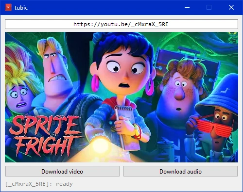

# tubic

A simple graphical interface for the [yt-dlp](https://github.com/yt-dlp/yt-dlp) tool.

The application is packed in a single executable file with no dependencies.

The target OS is currently Windows ≥ 10. Though, there's no OS-dependent features or libs used, so you're free to try and build it on Linux.

--- 

## License

- Current repository is licensed under [MIT License](https://github.com/sentenzo/tubic/blob/master/LICENSE)
- The icons for this application were taken from paomedia's [small-n-flat](https://github.com/paomedia/small-n-flat) set and licensed under [CC0 1.0 Universal](https://github.com/paomedia/small-n-flat/blob/master/LICENSE)
